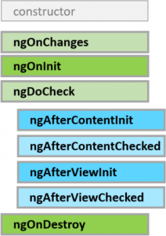

<!-- wp:paragraph -->

Every component in Angular has a lifecycle. It gets created in the beginning and destroyed in the very end. There are plenty of other interesting lifecycle events that happen in between that we will take a look at here. Below is an image of all the lifecycle events in order. Notice how everything begins with the constructor of the component.

<!-- /wp:paragraph -->

<!-- wp:image {"align":"center","id":2243,"width":219,"height":310,"sizeSlug":"medium"} -->

<!-- /wp:image -->

<!-- wp:paragraph -->

We'll take a deeper dive into all of these lifecycle events below.

<!-- /wp:paragraph -->

<!-- wp:heading {"level":3} -->

### What is a lifecycle hook?

<!-- /wp:heading -->

<!-- wp:paragraph -->

Angular gives us the ability to 'hook' into all of a components lifecycle events. These events fire off throughout the lifecycle of a component and we can grab on to them and execute certain pieces of code when they fire off.

<!-- /wp:paragraph -->

<!-- wp:paragraph -->

What is a lifecycle event?

<!-- /wp:paragraph -->

<!-- wp:paragraph -->

Common Lifecycle Hooks

<!-- /wp:paragraph -->

<!-- wp:paragraph -->

Uncommon Lifecycle Hooks

<!-- /wp:paragraph -->
