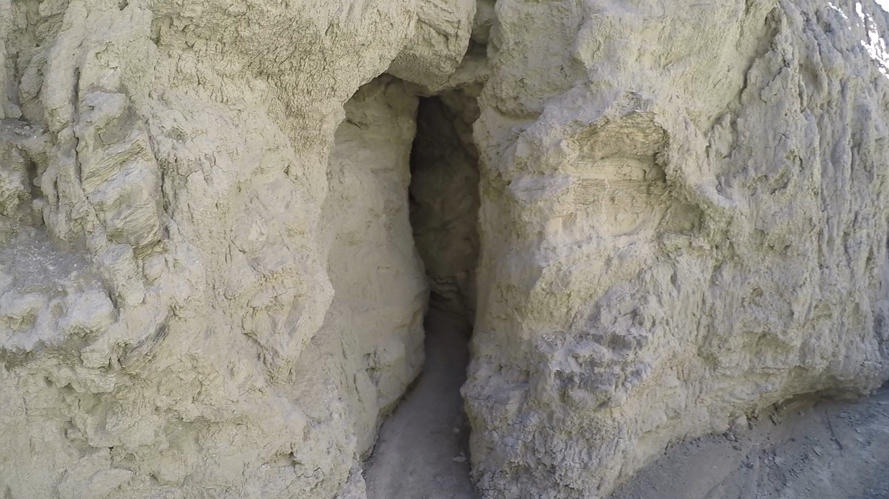
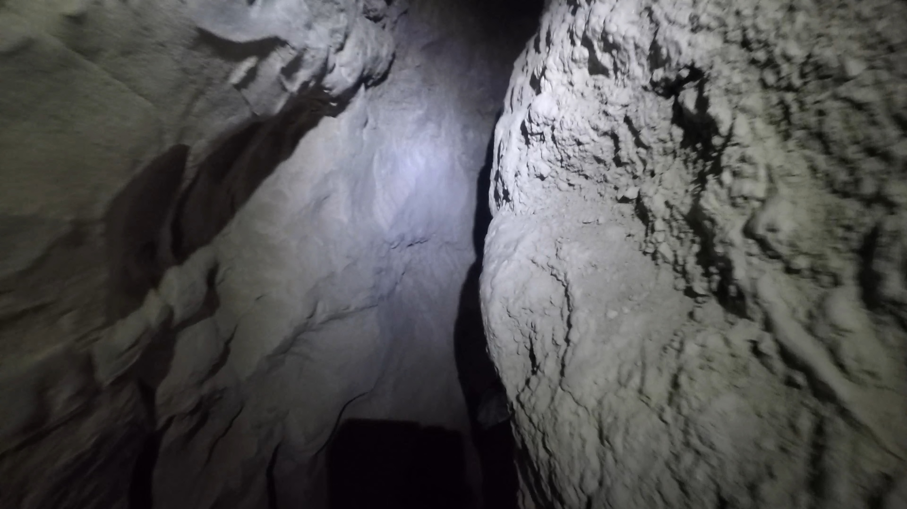
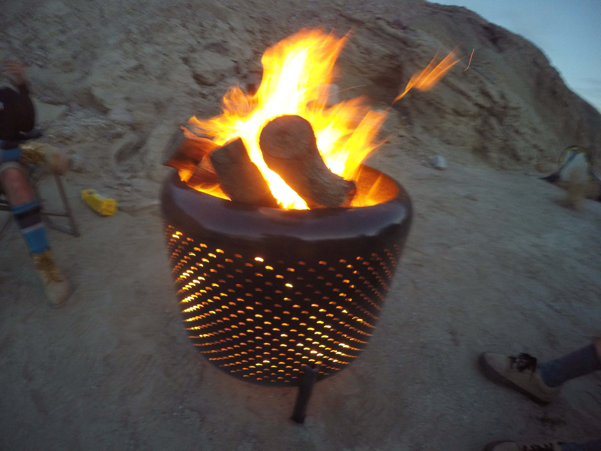

Part two of the Winter 2016 camping trip was the Arroyo Tapiado Mud Caves in Anza Borrego State Park. This is one of my favorite spots to explore in Anza Borrego. One of the main reasons for that is you can really get some solitude. Only street-legal vehicles are allowed in this part of the park, so you do not have to worry about dirt bikes or quads tearing through the area.**Directions: **

- Get yourself to the S2 either from the 78, 76, or 79 depending on where you are coming from.
- Take the S2 until right about mile marker 43
- Take the dirt road on your left named Vallecito Creek for 4.5 miles
- You will see a small sign for Arroyo Tapiado Wash you will make a hard left here
- Follow the wash, and you will begin to see signs of caves and canyons shortly

\*\*\*\*\_\_

### Warnings:

- Never go in the caves alone, always bring a buddy, and even better have someone who is not going in caves know where you are going
- Never go in the caves while it is raining or after there has recently been rain

### **Things to bring/plan for when going to the mud caves**

- GPS with routes of caves loaded onto it

  - http://ropewiki.com/Mud_Caves_(Arroyo_Tapiado)

- Headlamps so you have two hands to stabilize you while in caves

  - Emphasis on plural, if one light goes out you do not want to be stuck without one in the cave

- Bandana or Neck Wrap - it gets dusty in the caves

- Lots of water - Bring too much water

- Gas in vehicle - there are no gas stations out there
