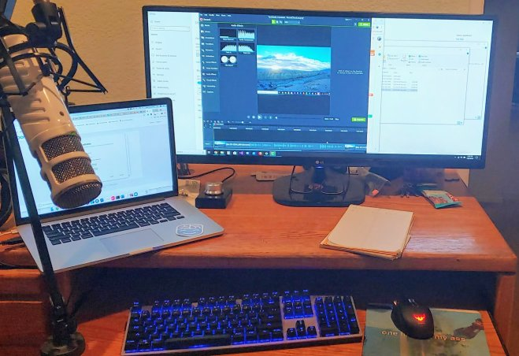

<!-- wp:paragraph -->

Recently, my time has been spent working towards creating my first ever online video course. I am currently generating content for a course focusing on C# ASP.Net RESTful API's. The course teaches students about API's and how to implement their own in C#. I will be publishing the course on [Thinkster.io](https://thinkster.io) later this year.

<!-- /wp:paragraph -->

<!-- wp:paragraph -->

I found out about [Thinkster.io](https://thinkster.io) at a recent conference that I attended. They were looking for content authors. I had recently put in my resignation as an instructor at my local university and wanted a new challenge. Authoring online courses had always intrigued me and the opportunity to work with the Thinkster team piqued my interests. Their focus on exercise-based learning was a big plus.

<!-- /wp:paragraph -->

<!-- wp:paragraph -->

I have a brand new recording configuration in my office and hope to generate a lot of video content. Take a look at my setup. I am excited to be working on my first ever online course and hope to create many more in the future.

<!-- /wp:paragraph -->

<!-- wp:image {"id":1693} -->

<!-- /wp:image -->

<!-- wp:paragraph -->

<!-- /wp:paragraph -->
