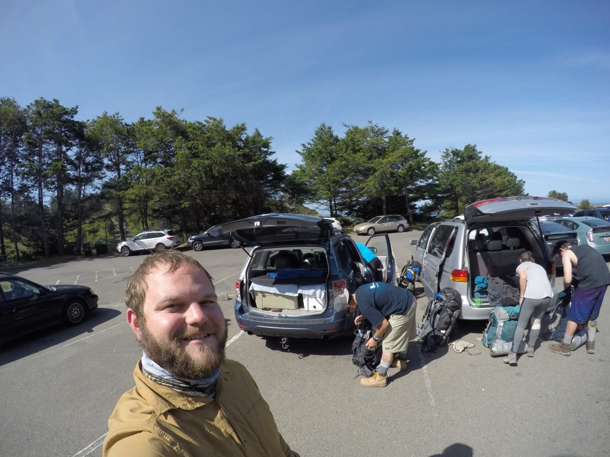
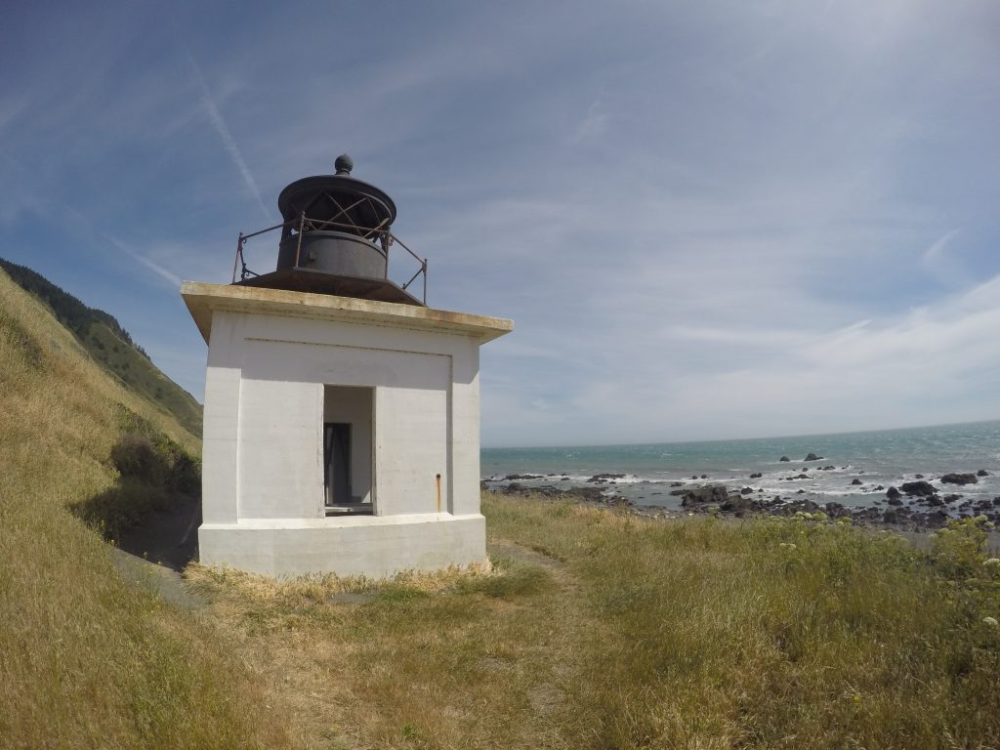
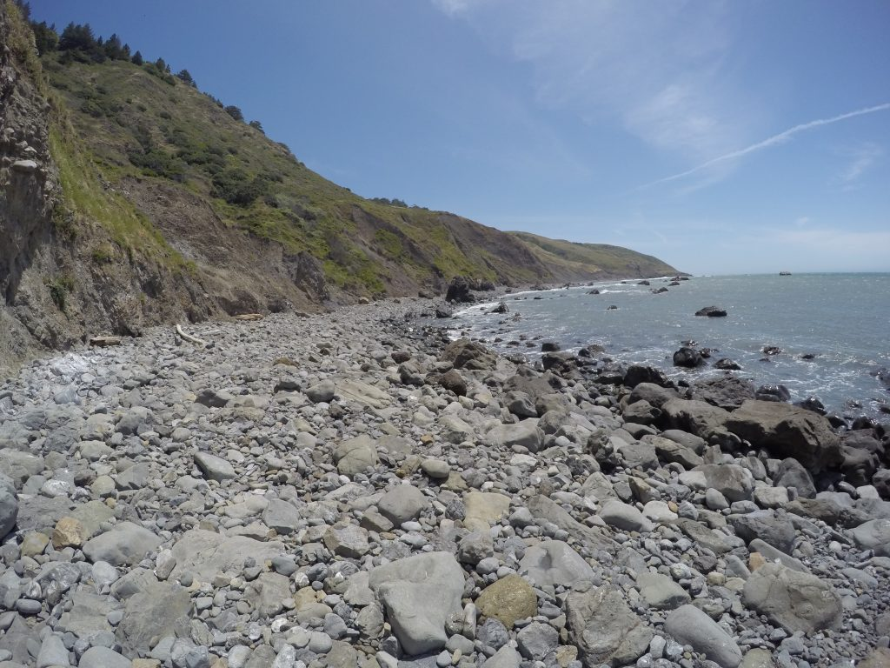
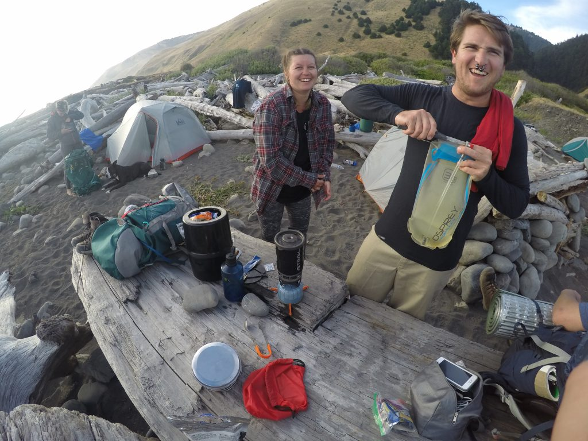
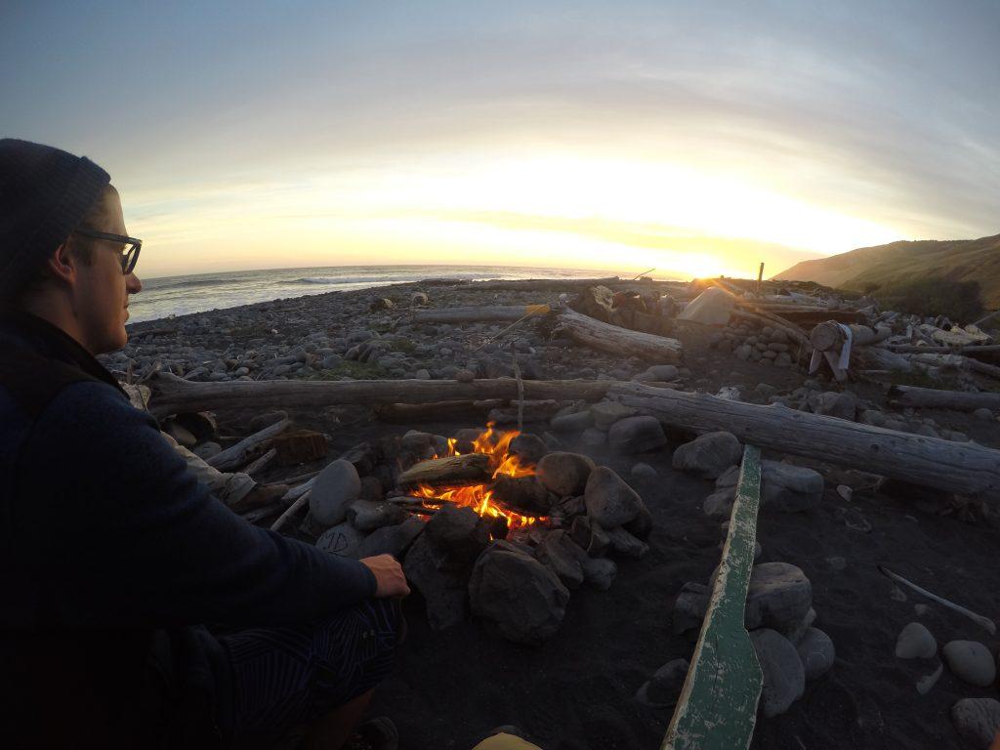
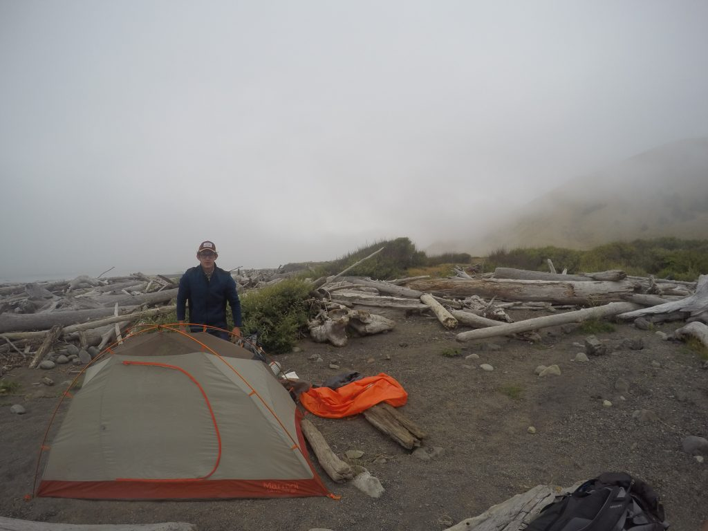
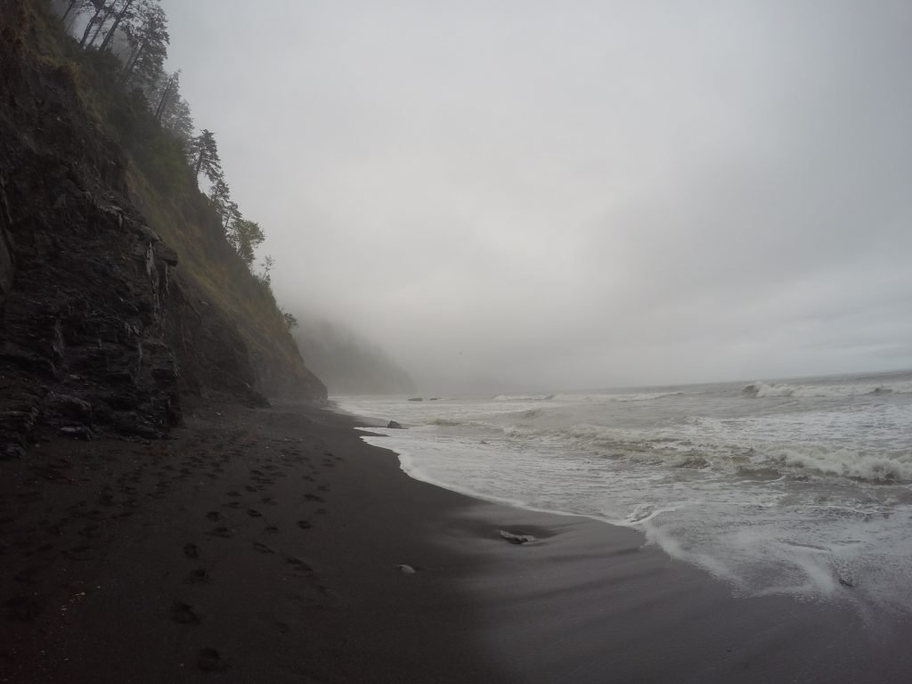
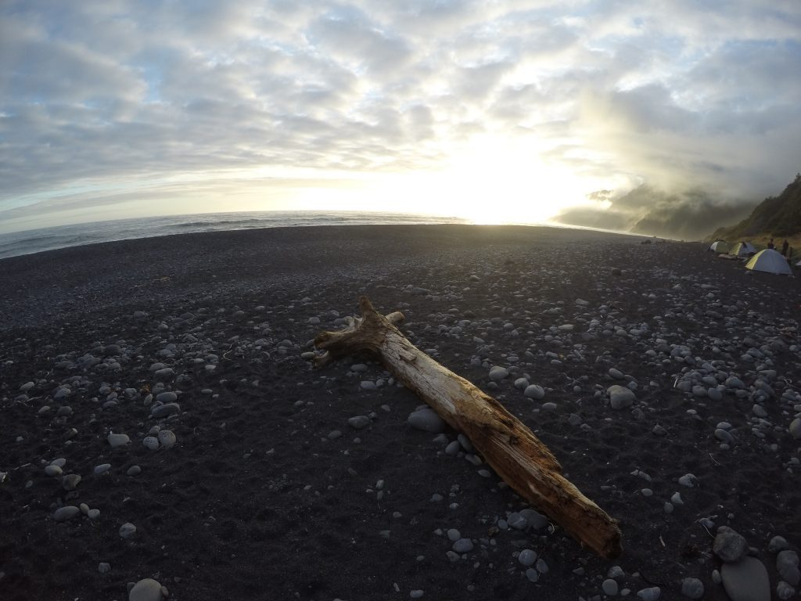
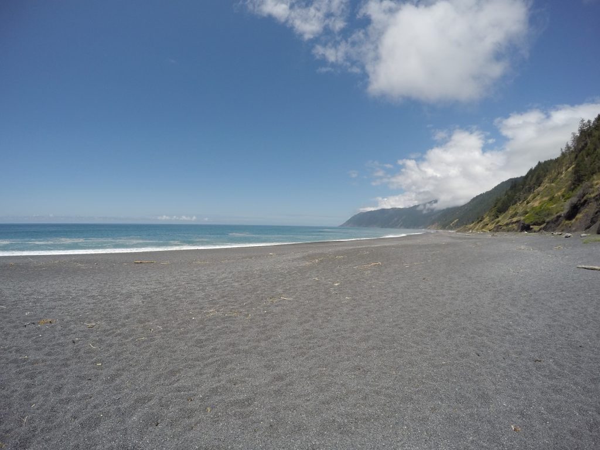

This blog has turned into more of a technical spot recently; however, it started as a place for me to share my favorite memories. This post will be about my 5-day backpacking trip with an amazing group of friends on the Lost Coast Trail in Northern California [King Range National Conservation Area](https://www.blm.gov/nlcs_web/sites/ca/st/en/prog/nlcs/King_Range_NCA.html). It is a memory I will never forget and want to share.

## Day 1 on The Lost Coast Trail

\*\*\*\*

- Starting the amazing Lost Coast Trail and all the excitement and adrenaline that came with it
- Exploring and playing around the Punta Gorda Lighthouse
- Having to have someone hold their tent down as we set it up because it was so windy
- Having our first campfire on the trail

## Day 2 On The Lost Coast Trail

\*\*\*\*

- Hiking along the bluffs, super windy and on the cliff edge
- Stepping foot in the tidal zone and realizing damn this trail is intense with nothing but rocks in sight
- Making it out of the tidal zone and onto the grassy Spanish Flats, was a relief to be on some solid ground
- Sitting by myself on the bluffs watching the waves and soaking in the graceful environment
- Resting around the camping enjoying the beautiful sunset

## Day 3 On The Lost Coast Trail

\*\*\*\*

- Hiking along the grassy bluff, seeing the grass wave in the wind.
- Freaking out a little bit coming across a large group of people performing silent meditation.
- Seeing a dead whale on the beach.
- Hiking in solitude really experiencing and enjoying the Lost Coast.

## Day 4 On The Lost Coast Trail

\*\*\*\*

- Maneuvering through the tidal zone attempting to stay as dry as possible.
- Watching the best sunset of the trip, sitting just above the shore break with all my friends
- Enjoying the camping area with other campers

## Day 5 On The Lost Coast Trail

