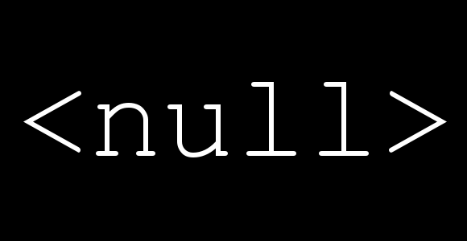

<!-- wp:image {"align":"right","id":2281,"width":237,"height":123,"sizeSlug":"large","className":"is-style-rounded"} -->

<!-- /wp:image -->

<!-- wp:paragraph -->

When first learning JavaScript I came across a new value _**undefined**_. I was familiar with and understood _**null**_ because of my .NET background but had never seen **undefined**. Let's take a deeper look at null and undefined in JavaScript.

<!-- /wp:paragraph -->

<!-- wp:heading -->

## null in JavaScript

<!-- /wp:heading -->

<!-- wp:paragraph -->

According to the JavaScript documentation: "The value \_**null** \_represents the **intentional **absence of any object value" ([Docs](https://developer.mozilla.org/en-US/docs/Web/JavaScript/Reference/Global_Objects/null)). null represents that there is no value, and it is important to not miss the intentional aspect.

<!-- /wp:paragraph -->

<!-- wp:paragraph -->

A value cannot be null unless it has specifically been assigned null. Let's look at some code:

<!-- /wp:paragraph -->

<!-- wp:embed {"url":"https://gist.github.com/thetombomb91/4e107ffcac0d9f1d0c47d05bedf29dc8","type":"rich","providerNameSlug":"embed-handler","className":""} -->

https://gist.github.com/thetombomb91/4e107ffcac0d9f1d0c47d05bedf29dc8

Example of null

<!-- /wp:embed -->

<!-- wp:paragraph -->

Above, on line 1 we are setting our value to null. null is powerful and something commonly found in code. There is even a [null object design pattern](https://sourcemaking.com/design_patterns/null_object).

<!-- /wp:paragraph -->

<!-- wp:heading -->

## undefined in JavaScript

<!-- /wp:heading -->

<!-- wp:paragraph -->

"A variable that has not been assigned a value is of type `undefined`" ([Docs](https://developer.mozilla.org/en-US/docs/Web/JavaScript/Reference/Global_Objects/undefined)). If we declare a variable but do not assign a value to it, its value is undefined.

<!-- /wp:paragraph -->

<!-- wp:embed {"url":"https://gist.github.com/thetombomb91/9e4529409793e0c8ba683916e13cd6c5","type":"rich","providerNameSlug":"embed-handler","className":""} -->

https://gist.github.com/thetombomb91/9e4529409793e0c8ba683916e13cd6c5

Example of undefined

<!-- /wp:embed -->

<!-- wp:paragraph -->

Since we didn't assign a value to temp on line 1 it is **undefined**.

<!-- /wp:paragraph -->

<!-- wp:paragraph -->

"A method or statement also returns **`undefined` **if the variable that is being evaluated does not have an assigned value." So we would see undefined if we access a property on an object that does not exist or does not contain a value.

<!-- /wp:paragraph -->

<!-- wp:embed {"url":"https://gist.github.com/thetombomb91/7ed6b39f4b48c2469ea86356e5c53c96","type":"rich","providerNameSlug":"embed-handler","className":""} -->

https://gist.github.com/thetombomb91/7ed6b39f4b48c2469ea86356e5c53c96

Example of undefined object property

<!-- /wp:embed -->

<!-- wp:paragraph -->

We don't need to be scared of undefined it just means the variable has never been assigned or does not exist.

<!-- /wp:paragraph -->

<!-- wp:heading -->

## null vs undefined equality gotcha

<!-- /wp:heading -->

<!-- wp:paragraph -->

There is a bit of a gotcha when thinking about equality of null vs undefined. Let's look at examples:

<!-- /wp:paragraph -->

<!-- wp:embed {"url":"https://gist.github.com/thetombomb91/3a3ced32798328d1d6e1f4e77a95bb1f","type":"rich","providerNameSlug":"embed-handler","className":""} -->

https://gist.github.com/thetombomb91/3a3ced32798328d1d6e1f4e77a95bb1f

null vs undefined equality example

<!-- /wp:embed -->

<!-- wp:paragraph -->

In the first strict equal (===) case, we get false returned. This is because both null and undefined evaluate to false **BUT **they are different object types. null is of type object while undefined is simply of type undefined.

<!-- /wp:paragraph -->

<!-- wp:image {"align":"right","id":2270,"width":161,"height":180,"sizeSlug":"large"} -->

<!-- /wp:image -->

<!-- wp:paragraph -->

That is why the second case of only loosely equal (==) we get true coming back. It's important to realize the distinction that null & undefined are different types.

<!-- /wp:paragraph -->

<!-- wp:paragraph -->

Having come from a .NET background I had not seen \_undefined \_before. With a little research and playing around with code, it all came together. I encourage you to open up your console window now and mess around a little with null and undefined!

<!-- /wp:paragraph -->
