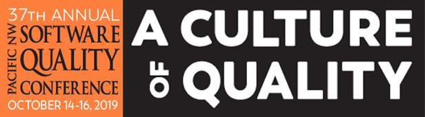

<!-- wp:paragraph -->

A few months back I was accepted to give a technical presentation at [PNSQC 2019](https://www.pnsqc.org/2019-conference/) (Pacific Northwest Software Quality Conference) titled Creating Quality with Mob Programming.

<!-- /wp:paragraph -->

<!-- wp:paragraph -->

My final draft of the technical write up has been turned in and will be published in the 2019 proceedings. The paper and findings will be shared at my presentation. I am excited and nervous about the presentation as it will be my first ever talk at a conference. I am definitely more excited than nervous though!

<!-- /wp:paragraph -->

<!-- wp:paragraph -->

Get more information on the talk here <https://www.pnsqc.org/creating-quality-with-mob-programming/>. If you can make it to PNSQC 2019 check out my talk.

<!-- /wp:paragraph -->

<!-- wp:image {"align":"center","id":1927} -->

<!-- /wp:image -->
