<!-- wp:paragraph -->

It's another camping post! In September I got to hike along the Trans Catalina Trail with some great friends. Here is a recount of our wondrous adventure.

<!-- /wp:paragraph -->

<!-- wp:image {"id":2323,"sizeSlug":"large","className":"is-style-default"} -->

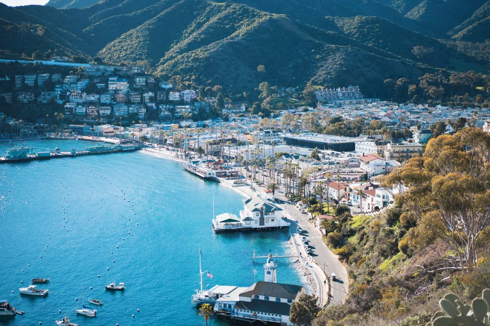

<!-- /wp:image -->

<!-- wp:heading -->

## Day One (Avalon to Hermit Gulch)

<!-- /wp:heading -->

<!-- wp:paragraph -->

For our first day, we needed to get to Catalina Island before we could take on the Trans Catalina Trail (TCT). There are a couple of boat options but we left the port at Dana Point because it was the closest for us coming from San Diego. A little over an hour boat ride on the Catalina Express and we were disembarking in Avalon, Catalina's biggest city. The latest census puts just over 3,700 people living in Avalon, which is actually more than I expected.

<!-- /wp:paragraph -->

<!-- wp:paragraph -->

Our first stop after getting off the boat was the [Catalina Conservancy](https://www.catalinaconservancy.org/) building. They have the best map at \$4 for anyone taking on the Trans Catalina Trail (TCT). If you have a nice printer you may be able to print it out from here: [Catalina Island TCT Map](https://catalinaconservancy.org/index.php?s=visit&p=hiking).

<!-- /wp:paragraph -->

<!-- wp:paragraph -->

It's fairly common for backpackers to head for [Black Jack Campground](https://www.visitcatalinaisland.com/lodging/camping/primitive-camping/blackjack/) their first day. But some of us had never experienced Avalon so we settled on staying in [Hermit Gulch Campground](https://www.visitcatalinaisland.com/lodging/camping/avalon-camping/hermit-gulch/) our first night. Hermit Gulch is the closest campground to Avalon at 1.5-miles out from downtown. So we headed to Hermit Gulch to drop our bags so we could head back into town and explore Avalon.

<!-- /wp:paragraph -->

<!-- wp:paragraph -->

Once back in town we headed to Lovers Cove. It was recommended to us as a great spot to snorkel. And the recommendation was right! We saw so many fish. So many garibaldi fish!

<!-- /wp:paragraph -->

<!-- wp:paragraph -->

After a little more Avalon exploring it was time to head back to camp. We picked up some food and beer and went back to Hermit Gulch. Our first day out camping exploring the 'wilderness' was a success. We were ready to take on the long day to Black Jack Campground tomorrow.

<!-- /wp:paragraph -->

<!-- wp:heading -->

## Day Two (Hermit Gulch to Black Jack Campground)

<!-- /wp:heading -->

<!-- wp:image {"align":"right","id":2312,"width":211,"height":293,"sizeSlug":"large","className":"is-style-rounded"} -->

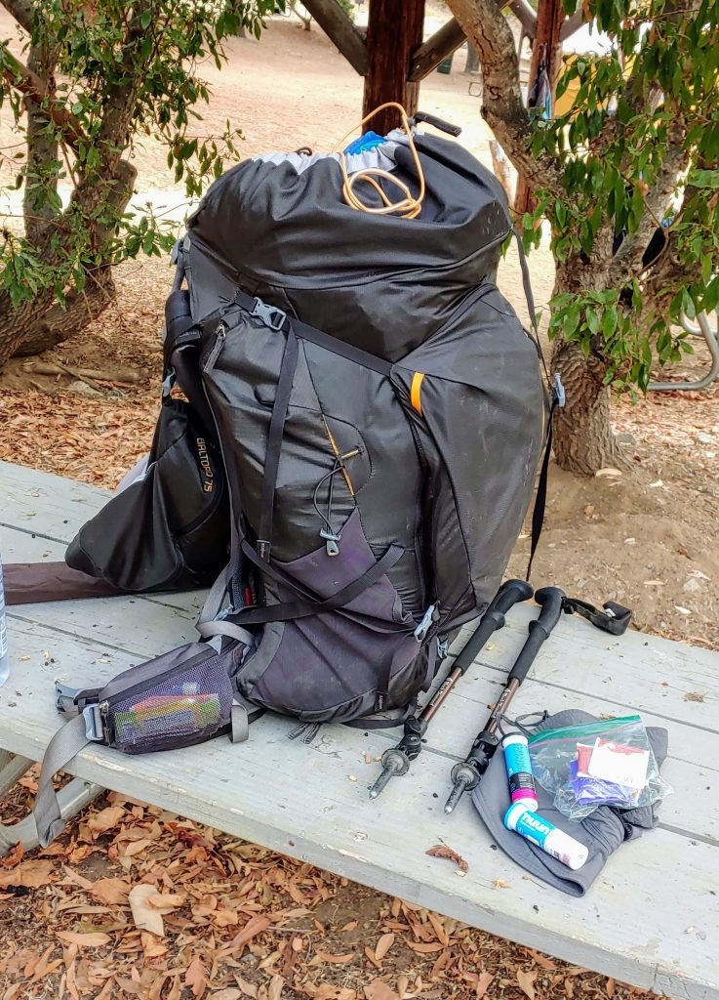

Packing up for our first hiking day on the trail

<!-- /wp:image -->

<!-- wp:paragraph -->

We woke up slow and packed up for our first real day on the trail. My bag felt heavier than ever (5 days of food will do that to ya).

<!-- /wp:paragraph -->

<!-- wp:paragraph -->

The hike out of Hermit Gulch starts with a steep 1.7-mile uphill trek. Luckily, after a hearty breakfast and good night's rest, this wasn't too difficult. After that initial steep uphill we had some fairly easy rolling hills for the next few miles.

<!-- /wp:paragraph -->

<!-- wp:paragraph -->

We were treated with beautiful views of both the east and west side of Catalina. Slowly we were getting further and further from Avalon and deeper into the Catalina hills.

<!-- /wp:paragraph -->

<!-- wp:paragraph -->

After a nice lunch at a park seeming in the middle of nowhere, we headed out to what would turn out to be a fairly difficult patch of the trail. Two rather significant declines then immediate inclines. These kicked our butts! The saving grace was the cooling ocean breeze but damn the inclines were steep. Steeper than this morning.

<!-- /wp:paragraph -->

<!-- wp:paragraph -->

Those inclines tired us out but we made it to Black Jack Campground! A nice open campground nestled up in the hills of Catalina.

<!-- /wp:paragraph -->

<!-- wp:gallery {"ids":[2316,2317,2319],"columns":2} -->

- 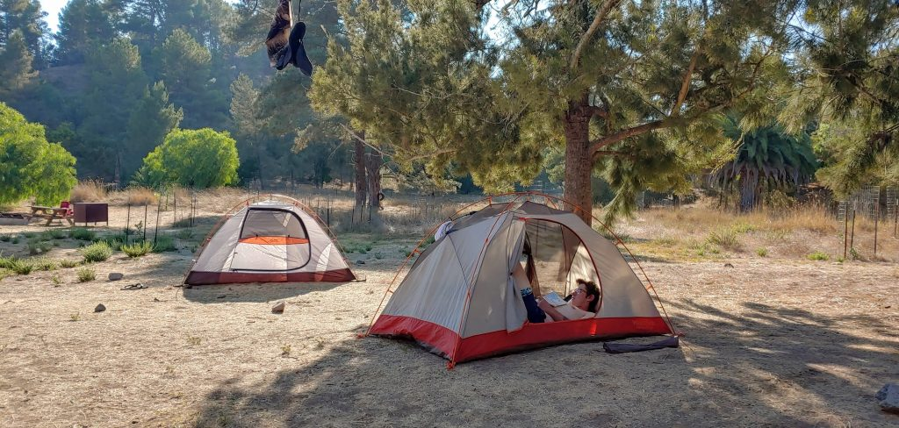

  Setting up camp in Black Jack Campground

- 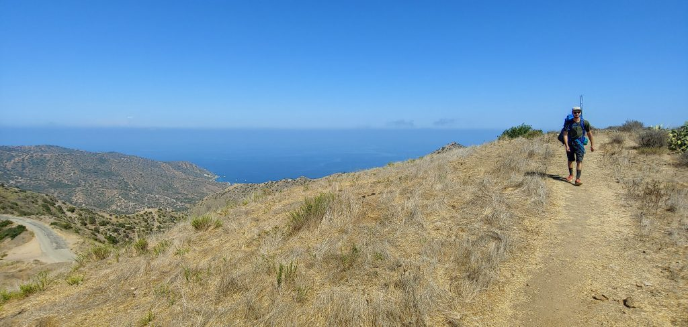

  Hiking the Trans Catalina Trail

- 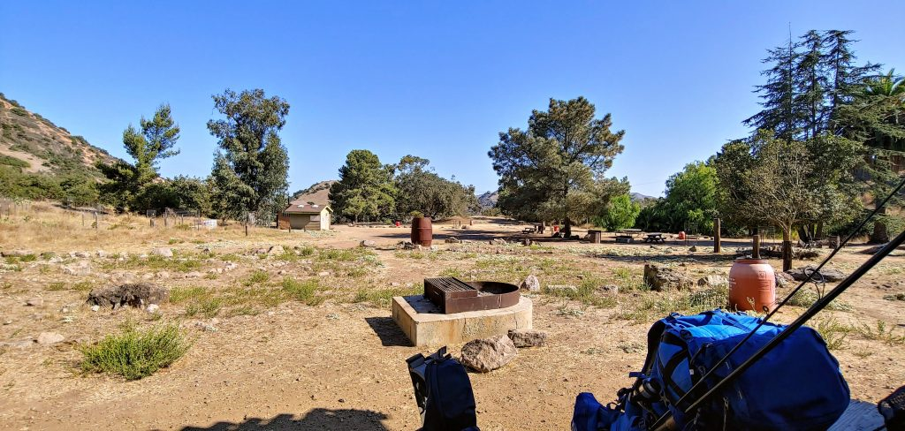

  View of Spot 10 at Black Jack Campground

<!-- /wp:gallery -->

<!-- wp:paragraph -->

After some well deserved laziness we set up camp and explored around Black Jack Campground. Soon came sunset. James and I hiked up the hill near the campground to get a good view. The sunset was a major highlight of the trip! A must do if you find yourself at Black Jack Campground.

<!-- /wp:paragraph -->

<!-- wp:image {"id":2321,"sizeSlug":"large","className":"is-style-default"} -->

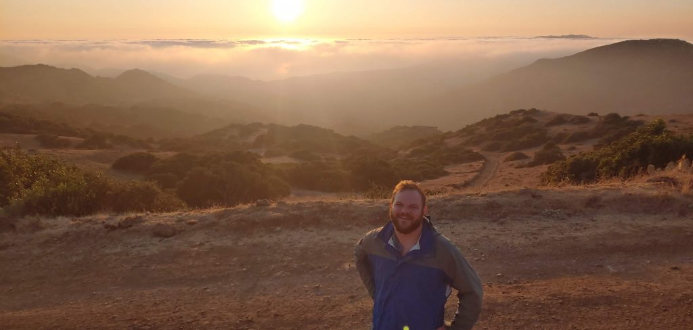

One of the best sunsets from Black Jack Campground

<!-- /wp:image -->

<!-- wp:paragraph -->

We enjoyed our time at camp and shortly after sundown I headed into my tent. We had another long day of hiking tomorrow but looking forward to being back on the trail.

<!-- /wp:paragraph -->

<!-- wp:heading -->

## Day Three (Black Jack to Little Harbor Campground)

<!-- /wp:heading -->

<!-- wp:image {"align":"left","id":2326,"width":216,"height":320,"sizeSlug":"large","className":"is-style-rounded"} -->

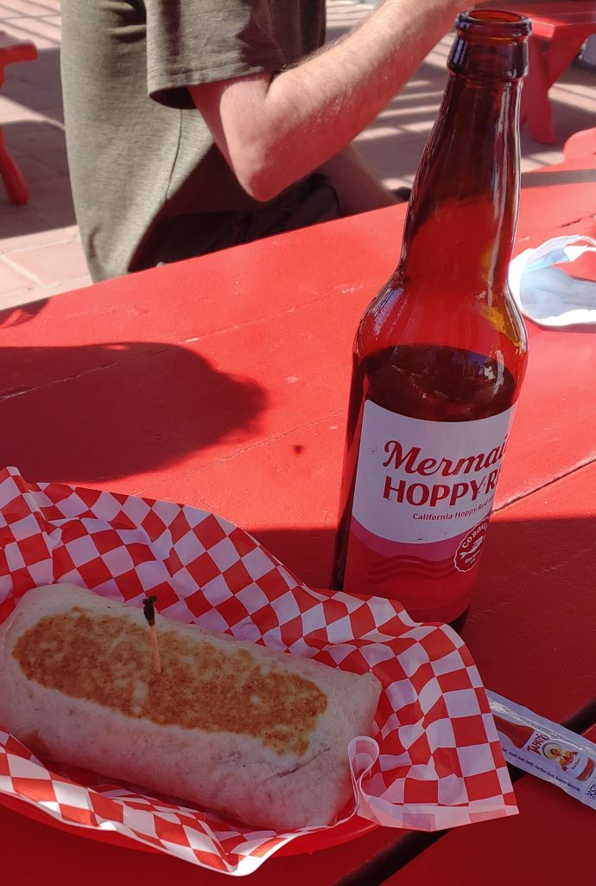

Catalina Airport in the Sky breakfast burrito

<!-- /wp:image -->

<!-- wp:paragraph -->

On day three, we were headed to [Little Harbor Campground](https://www.visitcatalinaisland.com/lodging/camping/two-harbors-camping/little-harbor/). The hike ahead of us was a little down and up to the airport then a solid 5 miles of downhill to get back to sea level and Little Harbor.

<!-- /wp:paragraph -->

<!-- wp:paragraph -->

The airport is worth stopping at. We skipped breakfast at the camp and got ourselves some amazing breakfast burritos at the airport. The airport has a small restaurant and a general store there. After our scrumptious burrito, we headed down the hill.

<!-- /wp:paragraph -->

<!-- wp:paragraph -->

One highlight of today was the big pack of bison we ran into. While hiking the trail we came upon at least 40 Bison grazing and lounging. We had to blaze our own trail to get around them. It can be very intimidating having 40 two thousand pound animals staring you down as you walk by.

<!-- /wp:paragraph -->

<!-- wp:image {"id":2327,"sizeSlug":"large"} -->

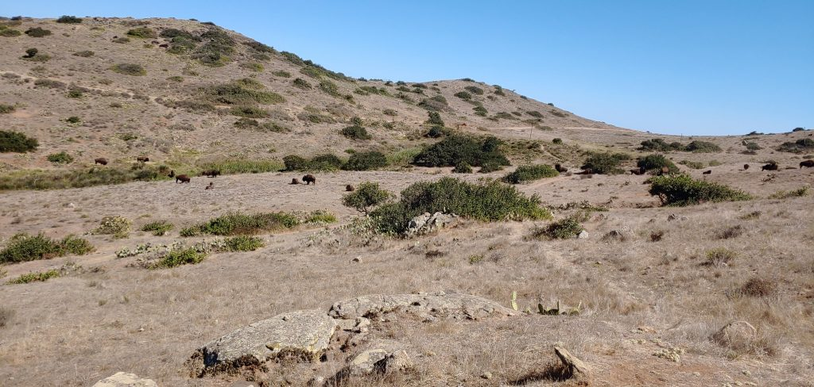

A big herd of Bison!

<!-- /wp:image -->

<!-- wp:paragraph -->

Today brought on some of the best views so far on the Trans Catalina Trail. We got amazing full panoramic views of the western side. Our Little Harbor destination was in sight but still a long way away. We continued our trek down the hills.

<!-- /wp:paragraph -->

<!-- wp:image {"id":2329,"sizeSlug":"large"} -->

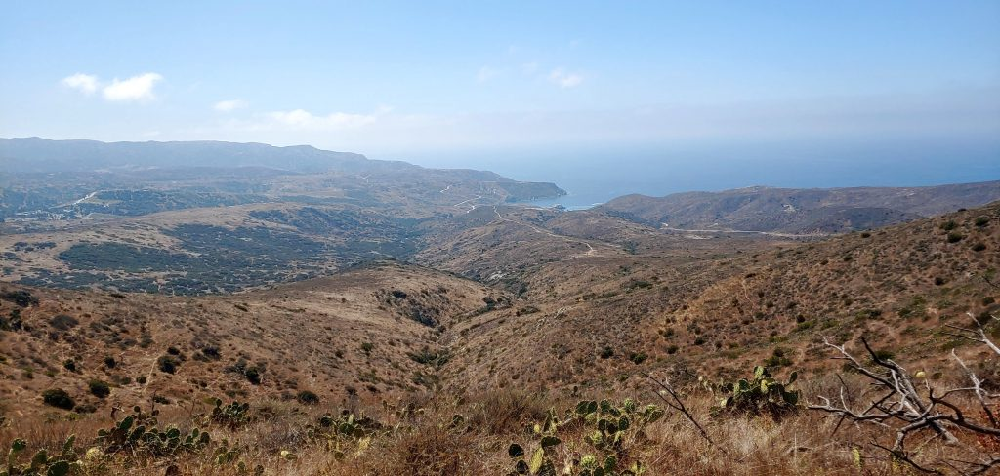

Western view toward Little Harbor Campground

<!-- /wp:image -->

<!-- wp:paragraph -->

We made it to Little Harbor and this is one of my most favorite campsites ever. I will definitely be coming back here. After dumping our pack at camp we went straight to the water. We ripped off our dirty dusty boots and put our tired feet in the surf. The cold water rushing over our feet felt incredible! We stood there quietly, soaking up the sun and letting the cold waves cool our tired feet.

<!-- /wp:paragraph -->

<!-- wp:paragraph -->

James had the great idea to cook our dinner on the bluff that evening. We enjoyed the best dinner view in all of southern California. And we were then treated to one of the best sunsets as well.

<!-- /wp:paragraph -->

<!-- wp:image {"id":2335,"sizeSlug":"large"} -->

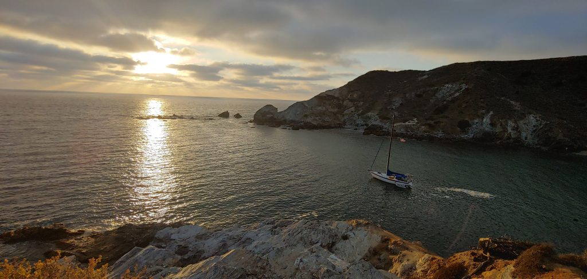

Beautiful sunset from the bluff at Little Harbor Campground

<!-- /wp:image -->

<!-- wp:image {"id":2336,"sizeSlug":"large"} -->

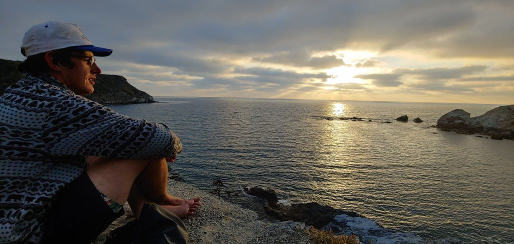

James enjoying the sunset from Little Harbor Campground

<!-- /wp:image -->

<!-- wp:paragraph -->

Little Harbor was an amazing location. It a perfect place to get away, have some seclusion, and enjoy the Pacific Ocean!

<!-- /wp:paragraph -->

<!-- wp:heading -->

## Day Four (Little Harbor to Two Harbors Campground)

<!-- /wp:heading -->

<!-- wp:paragraph -->

The hike from Little Harbor to Two Harbors Campground was technically the shortest distance day of our hiking trip. However, after two long days of hiking we were pretty beat up, our knees especially. We were met with a strong incline in the morning starting out followed with a steep decline down into Two Harbors.

<!-- /wp:paragraph -->

<!-- wp:paragraph -->

Again, I cannot emphasize too much the incredible views offered by the Trans Catalina Trail. We were treated with long coastline views along the Catalina West coast.

<!-- /wp:paragraph -->

<!-- wp:image {"id":2339,"sizeSlug":"large"} -->

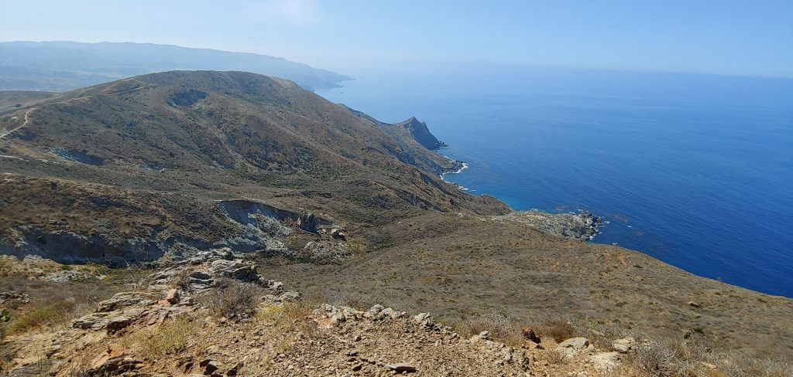

<!-- /wp:image -->

<!-- wp:paragraph -->

With our knees hurting and legs feeling like jello we descended into Two Harbors. Two Harbors is a very small 'town' on the North East side of Catalina Island. It has one restaurant and one well-stocked market. Immediately upon arriving in Two Harbors we made a beer run to the market so we could relax for a moment before setting up camp.

<!-- /wp:paragraph -->

<!-- wp:image {"id":2341,"sizeSlug":"large"} -->

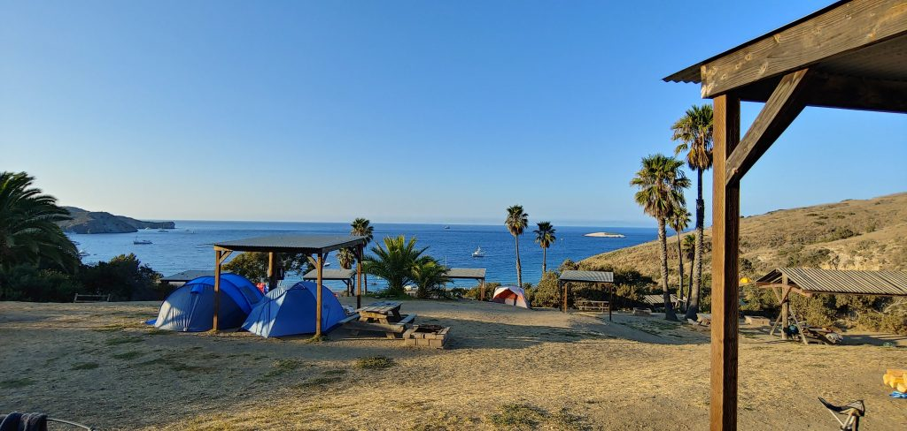

View from Campsite 28 at Two Harbors Catalina Island

<!-- /wp:image -->

<!-- wp:paragraph -->

Camp took a little longer to set up, couldn't have been because of the drinks. Once camp was set up all we wanted to do was sit by the ocean. Again we wanted to rest our weary feet in the cool ocean water.

<!-- /wp:paragraph -->

<!-- wp:paragraph -->

One other great thing about being in a more established 'town' meant that we could get firewood. Tonight was our first night where we could relax around a fire. Our trip was not over yet but we shared stories about what we had enjoyed the most so far while on Catalina Island.

<!-- /wp:paragraph -->

<!-- wp:heading -->

## Day 5 (Eating and Relaxing at Two Harbors)

<!-- /wp:heading -->

<!-- wp:paragraph -->

We had planned to spend two nights in Two Harbors. Mostly because we could not get a reservation at Pearson's Landing. Our thought was that we would go for a day hike today. That did not happen...we were lazy and it was GREAT!

<!-- /wp:paragraph -->

<!-- wp:paragraph -->

None of us strayed too far from Two Harbors. We went to the market for food a couple of times. The restaurant for a meal at least once. Kodi did some fishing and did bring back 10 small fish that we ended up frying up that evening.

<!-- /wp:paragraph -->

<!-- wp:paragraph -->

The joke of the day was that we were having a second breakfast, second lunch, and second dinner. We were EATING all day. At one point, I fell asleep on the beach soaking up the rays. I'm very happy we decided to make this the laziest day ever.

<!-- /wp:paragraph -->

<!-- wp:image {"id":2344,"sizeSlug":"large"} -->

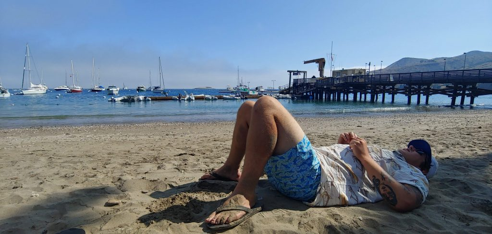

James lazily laying on the beach, taking the day off!

<!-- /wp:image -->

<!-- wp:heading -->

## Day 6 (Back to the mainland)

<!-- /wp:heading -->

<!-- wp:paragraph -->

Catalina Island had treated us well. We may not have been ready to go home yet but we knew we had to.

<!-- /wp:paragraph -->

<!-- wp:paragraph -->

Our jet boat that would take us from Two Harbors back to Avalon was delayed for a little. So of course, we picked up a bottle of wine and enjoyed that on the beach. Our boat showed up soon though and took us back to Avalon. Avalon isn't too big but it did feel a little strange all of a sudden being surrounded by so many people. I was still used to the open trail with almost no one in sight.

<!-- /wp:paragraph -->

<!-- wp:paragraph -->

We had a few hours to relax in Avalon before our boat ride back to Dana Point. Unfortunately, the Casino was not open but we were able to walk around it and enjoy the architecture. We did learn that the Casino on Catalina Island was never actually a Casino as we know them. The name comes from the Italian word Casino which means gathering place. So no gambling actually ever happened here.

<!-- /wp:paragraph -->

<!-- wp:image {"id":2346,"sizeSlug":"large"} -->

Lovers Cove near Avalon on Catalina Island (Great Snorkeling)

<!-- /wp:image -->

<!-- wp:paragraph -->

With the rest of our free time, we ate. We at so much the day before why stop that streak and eat some more! Our Catalina Express ship soon arrived and we hopped on for our hour or so ride back to Dana Point.

<!-- /wp:paragraph -->

<!-- wp:paragraph -->

We left Catalina Island feeling great and wanting more. I'll definitely be making more trips out to the island. There is still more to explore and enjoy on the cool little island in the Pacific.

<!-- /wp:paragraph -->

<!-- wp:paragraph -->

<!-- /wp:paragraph -->
