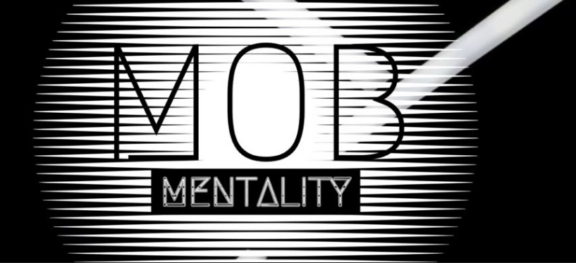

<!-- wp:image {"align":"right","id":1987,"width":300,"height":187,"linkDestination":"custom"} -->

<!-- /wp:image -->

<!-- wp:paragraph -->

Over the past two weeks, I have been a guest on two podcasts [The Mob Mentality Show](https://www.youtube.com/channel/UCgt1lVMrdwlZKBaerxxp2iQ) and the [Dev Ed Podcast](https://devchat.tv/dev-ed/). These two recordings have been my first ever experiences on a podcast and I have to say they were both lots of fun! As of right now, the two recordings are not live but expect posts in the upcoming weeks highlighting the recordings.

<!-- /wp:paragraph -->

<!-- wp:paragraph -->

On The Mob Mentality Show, I got to talk about my recent presentation at the Pacific Northwest Software Quality Conference on Creating Quality with Mob Programming. I also got to talk about my other experiences as a mob programmer for the past 4 years.

<!-- /wp:paragraph -->

<!-- wp:image {"align":"left","id":1988,"width":200,"height":330,"linkDestination":"custom"} -->

<!-- /wp:image -->

<!-- wp:paragraph -->

For the Dev Ed Podcast, the topic was ASP.Net. I have a course coming out very soon on Thinkster.io teaching how to create a C# ASP.Net Core API so that is why the topic was ASP.Net. I got to speak to ASP.Net but also my experience as a university instructor.

<!-- /wp:paragraph -->

<!-- wp:paragraph -->

When the two podcasts are live and out in the wild I will be sure to update the post with links! Also, I hope to be a part of many more podcasts in the future.

<!-- /wp:paragraph -->
