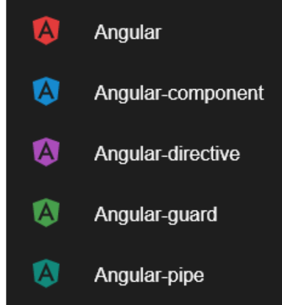
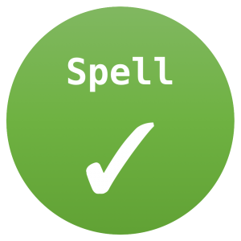

<!-- wp:paragraph -->

Let's take a look at the VS Code extension that I use regularly when developing Angular code. I like my extension to make me a more productive developer. Many of these could be helpful outside of Angular development but these are some that I like.

<!-- /wp:paragraph -->

<!-- wp:heading {"level":4} -->

#### #1 [Angular Snippets](https://marketplace.visualstudio.com/items?itemName=johnpapa.Angular2)

<!-- /wp:heading -->

<!-- wp:paragraph -->

This extension is great because it gives you access to many useful Angular, Typescript, and even HTML. I find myself using the HTTP related snippets often. Snippets are great because you no longer need to memorize complex syntax and can now focus on the development.

<!-- /wp:paragraph -->

<!-- wp:heading {"level":4} -->

#### #2 [Material Theme Icons](https://marketplace.visualstudio.com/items?itemName=PKief.material-icon-theme)

<!-- /wp:heading -->

<!-- wp:image {"align":"right","id":2235,"width":175,"sizeSlug":"large"} -->

<!-- /wp:image -->

<!-- wp:paragraph -->

Material Theme Icons is great because it changes all the icons used throughout VSCode with beautiful icons. It makes it much easier to discern between the different files in your project. Not only does it have icons for the different file types but also folder types. I highly recommend this extension to make your editor look nice and clean.

<!-- /wp:paragraph -->

<!-- wp:heading {"level":4} -->

#### #3 [Bracket Pair Colorizer 2](https://marketplace.visualstudio.com/items?itemName=CoenraadS.bracket-pair-colorizer-2)

<!-- /wp:heading -->

<!-- wp:paragraph -->

Bracket Pair Colorizer is one of the first extensions I install when if I come across a machine that does not have it. It changes the colors of all your brackets, parenthesis, etc. It even creates a line that connects each pair to one another. Just make sure to install version 2 because that is the one being actively developed.

<!-- /wp:paragraph -->

<!-- wp:gallery {"ids":[2236]} -->

- 

<!-- /wp:gallery -->

<!-- wp:heading {"level":4} -->

#### #4 [Typescript Importer](https://marketplace.visualstudio.com/items?itemName=pmneo.tsimporter)

<!-- /wp:heading -->

<!-- wp:paragraph -->

This one is helpful when working in our Typescript components. It will auto-import definitions for us. So if we start using a new service or a new model in our component on the first use it will automatically bring in the import. Again, this helps us focus on the development work not having to jump around the file importing new things.

<!-- /wp:paragraph -->

<!-- wp:heading {"level":4} -->

#### #5 [Angular Language Service](https://marketplace.visualstudio.com/items?itemName=Angular.ng-template)

<!-- /wp:heading -->

<!-- wp:gallery {"ids":[2239],"align":"right"} -->

- 

<!-- /wp:gallery -->

<!-- wp:paragraph -->

Angular Language Service is another great Angular extension. This one is developed by the Angular team itself. It helps make VSCode smarter with its auto completes and giving hints about what to do next in your Angular code. This one is a must-have for Angular development.

<!-- /wp:paragraph -->

<!-- wp:heading {"level":4} -->

#### #6 [Code Spell Checker](https://marketplace.visualstudio.com/items?itemName=streetsidesoftware.code-spell-checker)

<!-- /wp:heading -->

<!-- wp:image {"align":"left","id":2246,"width":94,"height":94,"sizeSlug":"medium"} -->

<!-- /wp:image -->

<!-- wp:paragraph -->

This is another extension that is helpful for any development done in VS Code. It checks the spelling of your code even for your camelCase variables. It is great at finding common spelling errors that we make in our code. This can be extremely helpful in finding those nasty spelling error bugs. Definitely add this extension to your VS Code if you have not already.

<!-- /wp:paragraph -->

<!-- wp:paragraph -->

<!-- /wp:paragraph -->
