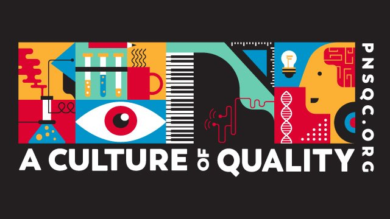

<!-- wp:image {"id":1944,"align":"center","width":320,"height":180,"linkDestination":"custom"} -->

<!-- /wp:image -->

<!-- wp:paragraph -->

This week I had the pleasure of attending and speaking at the Pacific Northwest Software Quality Conference (PNSQC). This is my second time attending the conference and my first time presenting at this conference or any conference for that matter.

<!-- /wp:paragraph -->

<!-- wp:paragraph -->

I wrote a technical paper and gave a presentation on **Creating Quality with Mob Programming**. Writing the paper was the most difficult part. I had not written a research paper in years. But it all came together and after writing the paper the presentation was easy. In addition, the presentation has boosted my confidence and makes me want to submit talks to more conferences.

<!-- /wp:paragraph -->

<!-- wp:paragraph -->

Unfortunately, the archived links of the paper and presentation slides are not available yet, but I will update this as soon as they are.

<!-- /wp:paragraph -->

<!-- wp:paragraph -->

The presentation was well-received. It sparked great conversations with people interested in learning more about Mob Programming. It helped to inspire a renewed passion for Mob Programming and reinforced that we must be doing something right.

<!-- /wp:paragraph -->

<!-- wp:paragraph -->

[Michael Larsen](https://twitter.com/mkltesthead?lang=en) attended my presentation. He was generous enough to write a live blog post on his thoughts on Mob Programming. Check it out here! (<https://www.mkltesthead.com/2019/10/creating-quality-with-mob-programming.html>)

<!-- /wp:paragraph -->

<!-- wp:paragraph -->

Without a doubt I want to attend and potentially speak at another PNSQC conference. The people, content, and downtown Portland location are great.

<!-- /wp:paragraph -->

<!-- wp:paragraph -->

Thanks again PNSQC 2019!

<!-- /wp:paragraph -->
