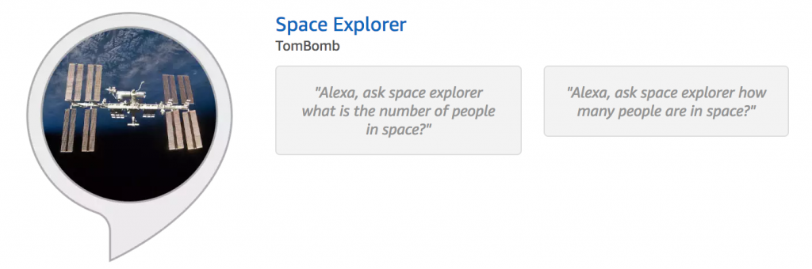

<!-- wp:paragraph -->

Recently I published [Space Explorer](https://www.amazon.com/TomBomb-Space-Explorer/dp/B07M5DH4FT/ref=sr_1_1?s=digital-skills&ie=UTF8&qid=1547653322&sr=1-1&keywords=space+explorer) my first ever Alexa Skill! I have been messing around with Alexa skill for a long time now but had never actually published anything.

<!-- /wp:paragraph -->

<!-- wp:paragraph -->

Space Explorer can tell you how many people are in space right now and the names of those people. A simple easy first skill. Space Explorer is nothing new to the skills market but it is my first skill and I wanted to keep it simple.

<!-- /wp:paragraph -->

<!-- wp:paragraph -->

The skill calls upon a simple api service that provides all the information needed. Possibly in the future I will add some features such as where the people are in space, what space crafts are in space, or where the International Space Station currently is.

<!-- /wp:paragraph -->

<!-- wp:paragraph -->

Overall making a skill for Alexa is not too difficult and I hope to make more of them in the future.

<!-- /wp:paragraph -->

<!-- wp:paragraph -->

Enable Space Explorer on your Alexa enabled devices here [Space Explorer](https://www.amazon.com/TomBomb-Space-Explorer/dp/B07M5DH4FT/ref=sr_1_1).

<!-- /wp:paragraph -->

<!-- wp:image {"id":1647} -->

<!-- /wp:image -->
