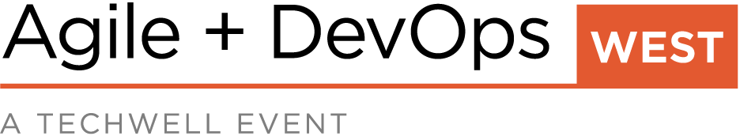

<!-- wp:paragraph -->

I have recently accepted a speaking position at [Agile + DevOps West 2020](https://agiledevopswest.techwell.com/speakers/thomas-desmond). I will be headed to Las Vegas in June 2020 to speak on "The Life of a Mob Programmer". I will be sharing my thoughts and experiences as a full-time Mob Programmer at Hunter Industries for the past four years.

<!-- /wp:paragraph -->

<!-- wp:paragraph -->

I am excited to share our development practices with everyone. How mob programming started. The benefits that I have experienced because of it. And why I enjoy mobbing every day.

<!-- /wp:paragraph -->

<!-- wp:paragraph -->

I do not need or want to convince people mob programming is what they need to do, but rather I do want to encourage people to innovate. Encourage people to try new things and break from a standard 'Agile' development practice.

<!-- /wp:paragraph -->

<!-- wp:paragraph -->

I encourage you to come to the Agile + DevOps West 2020 conference and you will find me speaking about Mob Programming June 11th!

<!-- /wp:paragraph -->

<!-- wp:image {"id":2098,"height":150,"sizeSlug":"large","linkDestination":"custom"} -->

<!-- /wp:image -->
