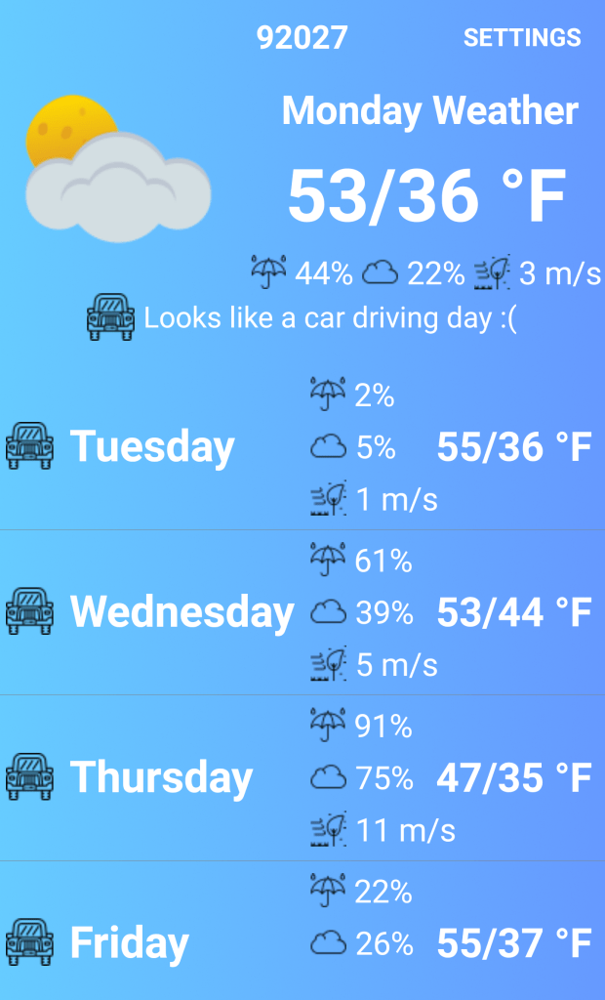

<!-- wp:paragraph -->

I have recently found motivation to work on my Android app [Weather Ride](https://play.google.com/store/apps/details?id=com.thetombomb.motorcycleridingweather). It is a weather app that makes suggestions on whether or not today or the current week is a good day to hop on your motorcycle and go for a ride.

<!-- /wp:paragraph -->

<!-- wp:paragraph -->

I did some refactoring over the past few weeks but the bulk of my work has been put into revamping the terrible UI. First I got a designer to create some mockups and icons. Then I began implementing the much more professional look and feel. Below you'll see the UI progress made so far.

<!-- /wp:paragraph -->

<!-- wp:image {"id":1657,"align":"center","width":310,"height":512} -->

<!-- /wp:image -->

<!-- wp:paragraph -->

There is still more to do. I have not had a chance to touch the settings screen yet. I have mockups for that and I hope to tackle it soon. It gets the job done but not in the prettiest way.

<!-- /wp:paragraph -->

<!-- wp:paragraph -->

Please install and provide feedback on [Weather Ride](https://play.google.com/store/apps/details?id=com.thetombomb.motorcycleridingweather) available in the Android play store now.

<!-- /wp:paragraph -->

<!-- wp:paragraph -->

<!-- /wp:paragraph -->
