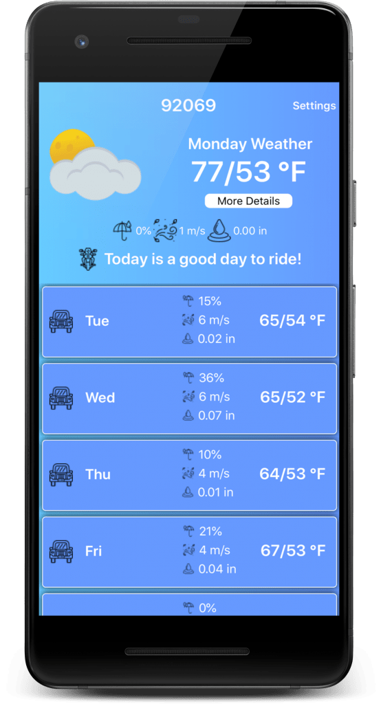
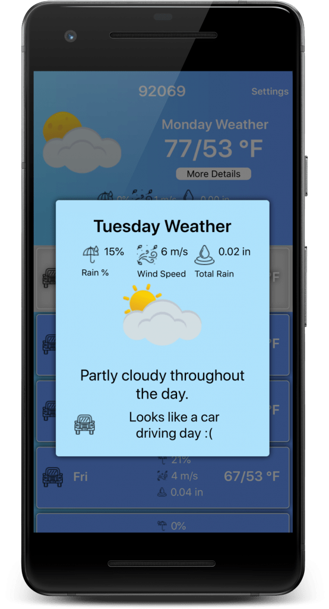

<!-- wp:paragraph -->

Weather Ride is officially released to the iOS app store. It's free and available to [download now](https://itunes.apple.com/us/app/motorcycle-weather-ride/id1457879287?ls=1&mt=8). Give it a go now!

<!-- /wp:paragraph -->

<!-- wp:jetpack/tiled-gallery {"ids":[1687,1680]} -->

<!-- /wp:jetpack/tiled-gallery -->

<!-- wp:paragraph -->

The app has been iOS ready for a while but I finally pulled the trigger and paid the \$99 subscription fee to get my Apple Developer account. I'm glad I did because now I've got my app in both major store iOS and Android.

<!-- /wp:paragraph -->

<!-- wp:paragraph -->

Now that it is getting more into Motorcycle Riding season I hope to promote the app more. I want it in the hands of more riders.

<!-- /wp:paragraph -->

<!-- wp:paragraph -->

Expect plenty updates in the future, a major focus is UI overhaul to allow the app to function better on smaller screens is in the works. Right now, you can check out the latest versions of Weather Ride on the [Android Play Store](https://play.google.com/store/apps/details?id=com.thetombomb.motorcycleridingweather) and the [iOS App Store](https://itunes.apple.com/us/app/motorcycle-weather-ride/id1457879287?ls=1&mt=8).

<!-- /wp:paragraph -->

<!-- wp:paragraph -->

<!-- /wp:paragraph -->
