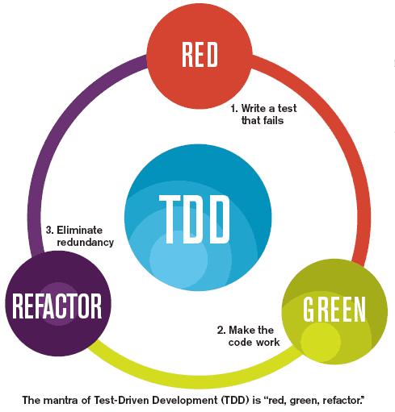

<!-- wp:paragraph -->

At my organization, we utilize test-driven development (TDD) to develop our software. To get a better understanding of TDD myself, I want to put together a post about what is test-driven development.

<!-- /wp:paragraph -->

<!-- wp:heading {"level":4} -->

#### What Is a Test?

<!-- /wp:heading -->

<!-- wp:paragraph -->

Before jumping straight into TDD let's define what a test is. A test is something that verifies that our code works as we expect it to. Typically, this is a procedure or method that executes and asserts that a given valid response is received.

<!-- /wp:paragraph -->

<!-- wp:paragraph -->

With a test, we verify that our code solves the problem it was intended to solve. That given a particular set of inputs and setup we get back the responses or see the changes that we would expect.

<!-- /wp:paragraph -->

<!-- wp:heading {"level":4} -->

#### What is Test-Driven Development?

<!-- /wp:heading -->

<!-- wp:image {"align":"right","id":1960,"width":200,"height":150} -->

<!-- /wp:image -->

<!-- wp:paragraph -->

_"_ TDD can be defined as a programming practice that instructs developers to write new code only if an automated test has failed._"_ [Guru99](https://www.guru99.com/test-driven-development.html)

<!-- /wp:paragraph -->

<!-- wp:paragraph -->

The above definition is from [Guru99](https://www.guru99.com/test-driven-development.html). Let's break it down and I will put TDD into my own words.

<!-- /wp:paragraph -->

<!-- wp:paragraph -->

The code we develop is driven forward by our test hence, Test-driven development. We write our test first before the implementation has been written. Making sure the test fails and for the right reason. Our test asserts proper functionality. Our test should satisfy the requirements of the software.

<!-- /wp:paragraph -->

<!-- wp:paragraph -->

We then write the code that makes the test pass. This means our production code is already under test because we wrote the test first.

<!-- /wp:paragraph -->

<!-- wp:heading {"level":4} -->

#### Red Green Refactor

<!-- /wp:heading -->

<!-- wp:paragraph -->

Red Green Refactor is an important concept in TDD. Above I described how we wrote a failing test this is the **red**. Then we wrote the actual implementation code to make the test pass this is the **green**.

<!-- /wp:paragraph -->

<!-- wp:paragraph -->

We have made it to the **refactor** step. Now that we have code written that is tested we can feel comfortable to refactor it. Maybe we see code duplication or any number of code smells.

<!-- /wp:paragraph -->

<!-- wp:paragraph -->

With the tests backing us up, we can feel comfortable modifying the code running our tests and ensuring we are still green.

<!-- /wp:paragraph -->

<!-- wp:image {"align":"center","id":1958,"width":489,"height":511,"linkDestination":"custom"} -->

<!-- /wp:image -->

<!-- wp:paragraph -->

The simple definition of Test-Driven Development is that we write our tests first. The code is tested from the very beginning. We gain the confidence to refactor and improve our code.

<!-- /wp:paragraph -->

<!-- wp:paragraph -->

Expect more posts on TDD as I expand my own knowledge of test-driven development!

<!-- /wp:paragraph -->
